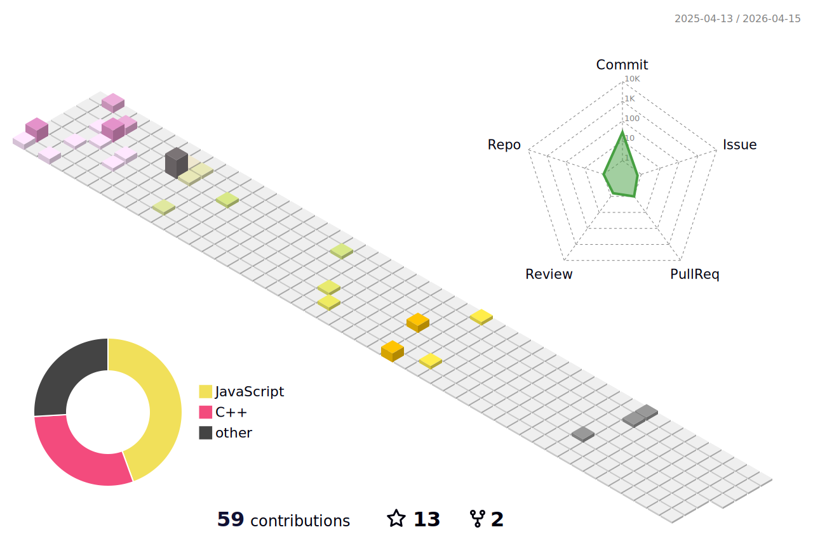

## Hi there 👋

  <b>This is the</b>
  
  <b>time I've been interviewed!</b>

&nbsp;

My name is Gao Haojia and I come from Beijing, China.
I'm a student majoring in AI at Fan Gongxiu Honors College, Beijing University of Technology.
In the 2024 season and 2025 season, I led our school to participate in the RoboMaster college robot competition as the captain and won several national awards.
I'm currently learning **neural networks**, **computer vision**, **SLAM**, and **path planning**.
Welcome to discuss with me.

&nbsp;

  <table>
    <tr>
      <td>
        <picture>
          <source media="(prefers-color-scheme: dark)" srcset="https://github-readme-stats.vercel.app/api/top-langs/?username=gaohaojia&layout=compact&theme=dark#gh-dark-mode-only" />
          <source media="(prefers-color-scheme: light)" srcset="https://github-readme-stats.vercel.app/api/top-langs/?username=gaohaojia&layout=compact&theme=light#gh-light-mode-only" />
          
        </picture>
      </td>
      <td>
        <picture>
          <source media="(prefers-color-scheme: dark)" srcset="https://github-readme-stats.vercel.app/api?username=gaohaojia&show_icons=true&theme=dark#gh-dark-mode-only" />
          <source media="(prefers-color-scheme: light)" srcset="https://github-readme-stats.vercel.app/api?username=gaohaojia&show_icons=true&theme=light#gh-light-mode-only" />
          
        </picture>
      </td>
    </tr>
  </table>

&nbsp;

<table>
  <tr>
    <td>
      <picture>
        <source media="(prefers-color-scheme: dark)" srcset="https://github-readme-activity-graph.vercel.app/graph?username=gaohaojia&theme=xcode&bg_color=FF000000&hide_border=true" />
        <source media="(prefers-color-scheme: light)" srcset="https://github-readme-activity-graph.vercel.app/graph?username=gaohaojia&theme=xcode&bg_color=FF000000&color=000000&hide_border=true" />
        
      </picture>
  </tr>
</table>

&nbsp;

<table>
  <tr>
    <td>
      <picture>
        <source media="(prefers-color-scheme: dark)" srcset="profile-3d-contrib/profile-night-rainbow.svg" />
        <source media="(prefers-color-scheme: light)" srcset="profile-3d-contrib/profile-season-animate.svg" />
        
      </picture>
  </tr>
</table>

<!--
**gaohaojia/gaohaojia** is a ✨ _special_ ✨ repository because its `README.md` (this file) appears on your GitHub profile.

Here are some ideas to get you started:

- 🔭 I’m currently working on ...
- 🌱 I’m currently learning ...
- 👯 I’m looking to collaborate on ...
- 🤔 I’m looking for help with ...
- 💬 Ask me about ...
- 📫 How to reach me: ...
- 😄 Pronouns: ...
- ⚡ Fun fact: ...
-->
