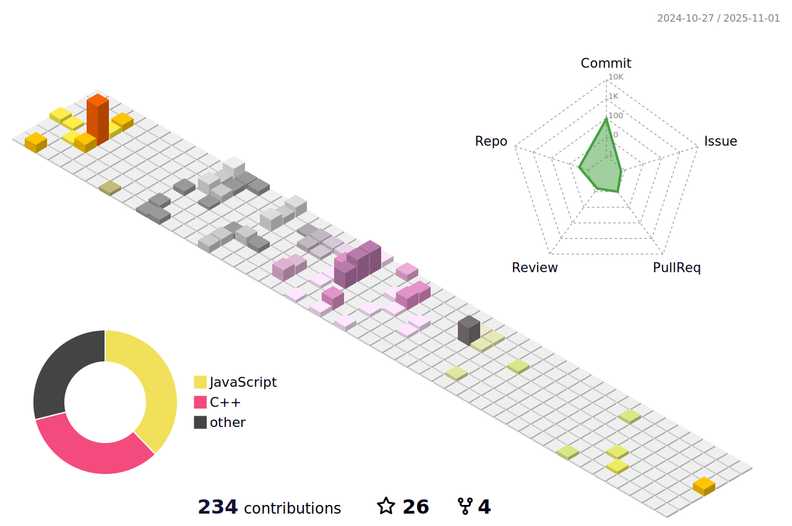

## Hi there 👋

Hello! My name is Haojia Gao and I come from Beijing, China. I'm currently an undergraduate student at the [Fan Gongxiu Honors College](https://fgx-hc.bjut.edu.cn/) of [Beijing University of Technology](https://english.bjut.edu.cn/), majoring in Artificial Intelligence, with an expected graduation in June 2026.

I'm fortunate to have been admitted to the [Tsinghua University](https://www.tsinghua.edu.cn/en/), [Tsinghua Shenzhen International Graduate School](https://www.sigs.tsinghua.edu.cn/en/) for postgraduate studies, where I'll pursue a master's degree in Artificial Intelligence starting September 2026. My research interests focus on Robotics and Embodied Intelligence.

Feel free to reach out and connect with me — I'm always open to interesting discussions and collaborations!

My Personal Website: <a href="https://www.gaohaojia.top/">zh</a> / <a href="https://aboutme.gaohaojia.top/">en</a>

&nbsp;

<!-- 

  <table>
    <tr>
      <td>
        <picture>
          <source media="(prefers-color-scheme: dark)" srcset="https://github-readme-stats.vercel.app/api/top-langs/?username=gaohaojia&layout=compact&theme=dark#gh-dark-mode-only" />
          <source media="(prefers-color-scheme: light)" srcset="https://github-readme-stats.vercel.app/api/top-langs/?username=gaohaojia&layout=compact&theme=light#gh-light-mode-only" />
          
        </picture>
      </td>
      
      <td>
        <picture>
          <source media="(prefers-color-scheme: dark)" srcset="https://github-readme-stats.vercel.app/api?username=gaohaojia&show_icons=true&theme=dark#gh-dark-mode-only" />
          <source media="(prefers-color-scheme: light)" srcset="https://github-readme-stats.vercel.app/api?username=gaohaojia&show_icons=true&theme=light#gh-light-mode-only" />
          
        </picture>
      </td>
     
    </tr>
  </table>

 -->

<!-- 
&nbsp;

<table>
  <tr>
    <td>
      <picture>
        <source media="(prefers-color-scheme: dark)" srcset="https://github-readme-activity-graph.vercel.app/graph?username=gaohaojia&theme=xcode&bg_color=FF000000&hide_border=true" />
        <source media="(prefers-color-scheme: light)" srcset="https://github-readme-activity-graph.vercel.app/graph?username=gaohaojia&theme=xcode&bg_color=FF000000&color=000000&hide_border=true" />
        
      </picture>
  </tr>
</table>

&nbsp;
 -->

<table>
  <tr>
    <td>
      <picture>
        <source media="(prefers-color-scheme: dark)" srcset="profile-3d-contrib/profile-night-rainbow.svg" />
        <source media="(prefers-color-scheme: light)" srcset="profile-3d-contrib/profile-season-animate.svg" />
        
      </picture>
  </tr>
</table>

<!--
**gaohaojia/gaohaojia** is a ✨ _special_ ✨ repository because its `README.md` (this file) appears on your GitHub profile.

Here are some ideas to get you started:

- 🔭 I’m currently working on ...
- 🌱 I’m currently learning ...
- 👯 I’m looking to collaborate on ...
- 🤔 I’m looking for help with ...
- 💬 Ask me about ...
- 📫 How to reach me: ...
- 😄 Pronouns: ...
- ⚡ Fun fact: ...
-->
